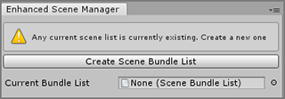

# Enhanced-Scene-Manager
This plugin allow you to create levels using multiple scenes to optimize your workflow and your application.

&nbsp;

## How to setup ?

### <ins><b>1 - Add the plugin to your project</b></ins>
This plugin should be cloned into your Unity project to access new updates. It's highly recommended to use git submodules : https://git-scm.com/book/en/v2/Git-Tools-Submodules

- <b>Method 1 (Recommended)</b> : Create a folder "Enhanced Scene Manager" into your Asset folder and clone the project into it from new repository or git submodule.
- <b>Method 2</b> : Download the project .zip file and unpack it directly in your Asset folder.

&nbsp;

### <ins><b>2 - Setup Enhanced Scene Manager in your project</ins></b>
Once the addon is imported in your project, two new types of assets appeared in your create panel.

- `Scene Bundle` : This asset is a group of scenes you want to load simultaneaously.
- `Scene Bundle List` :  The equivalent of build setting scene. Group every `Scene Bundle` you want to use and build in your application. Contains also a <b>Persistant Scene Bundle</b> that will be loaded only once and persist while application is running. 

To setup this, go to "Window/Enhanced Scene Manager" to deploy the Enhanced Scene Manager window. 

By default the window suggest you to create a new `Scene Bundle List`. Create a new one. You also can create a new `Scene Bundle List` from "Create/Enhanced Scene Manager/Scene Bundle List".



#### <ins>- The Scene Bundle List</ins> 


Once your `Scene Bundle List` is ready, you can fill it with `Scene Bundles`, refer a Persistant Scene Bundle if your application architecture requires it.
<b>The first bundle in the Scene Bundles List will be the first loaded in the application !</b>. 

<em>(tip : Lock the inspector, select the `Scene Bundles` and click + button to directly refer selected Scenes Bundles)</em>.


#### <ins>- The Scene Bundle</ins> 


To create a new `Scene Bundle`, go to <b>"Create/Enhanced Scene Manager/Scene Bundle".</b>
In this one, refer all the `Scene Assets` you want to load into it <em>.

(tip : Lock the inspector, select the `Scene Assets` and click + button to directly refer selected Scenes)</em>.

Register your bundles in your current `Scene Bundle List` to add it to the build setting and load/access it from the Enhanced Scene Manager Window.


#### <ins>- Enhanced Scene Manager Window</ins> 


Deploy it from "Window/Enhanced Scene Manager".

On Enhanced Scene Manager, select `Scene Bundle` to load it and select <b>A</b> to select his asset.
You also can set the current used Scene Bundle List (Note : For example you can have multiple Scene Bundle list if you want to build levels separately for prototyping or debug for example).

&nbsp;

### <ins><b>3 - Load a Scene Bundle</ins></b>

Loading a scene bundle is pretty easy. You just need a Scene Bundle reference and call the <b>Load()</b> method from it.

```cs
public void Load();
```

```cs
using UnityEngine;
using SorangonToolset.EnhancedSceneManager;

public class LevelLoader : MonoBehaviour{
    [SerializeField] private SceneBundle levelToLoad = null;

    public void OnGUI(){
        if(GUILayout.Button("LoadLevel")){
            //Just call the Load() method from Scene Bundle
            levelToLoad.Load();
        }
    }
}
```

You also can call LoadAsync().This is recommended to use more often than Load().

```cs
public void LoadAsync();
```

You can call those methods from a `Unity Event`.


<b>! The level you want to load must be registered in the <ins>Current Scene List</ins> !</b>

&nbsp;

## Recommended Usages

<ins><b>- Manage your application with Persistant Scene Bundle.</ins></b></br>
The Persistant Scene Bundle can <b>manage the core logic of your application</b>. Use those scenes to setup your game manager, loading screens, runtime debugging tools and much more !


<ins><b>- Separate your datas to make teamwork easier.</ins></b></br>
For example, for a level you can make a logic scene that manage the logic and gameplay part and also make a graphic level on which you will create your level environment art. This allow you and your team <b>to work simultaneously on the same level</b> on his proper part <b>without having merge problems</b>.


<ins><b>- Reuse your scenes to reduce application weight.</ins></b></br>
For example, you want to create 2 levels in a same environment. With this system, you san separate the graphic part of the level in a scene and use 2 others one to manage different levels logic then reference the same graphic scene in two differents bundles. 
